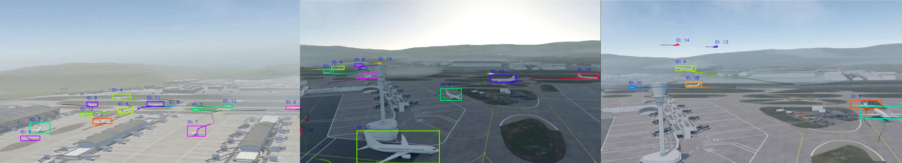

# The AirTrackSim'25 Dataset

This repository provides description and link to a synthetic image dataset 
for neural learning tasks in wide-area surveillance scenarios. 

The **AirTrackSim25** dataset is a synthetic dataset designed for research 
in **multi-object tracking (MOT)** and **object detection** in the context of automated airport visual surveillance.
The dataset was generated using the AirTrackSim'25 simulation framework, which is capable of rendering photorealistic images of an airport environment from multiple perspectives.
The AirTrackSim'25 dataset only consists of images (and annotations), which are *Creations of Imagery* rendered from the TurboSquid model “London Heathrow Airport – LHR” (ID 1543630).

The dataset is designed to help advance the development of tracking algorithms by providing a diverse set of training and testing sequences with a focus on small object detection, especially for aircraft in a busy airport environment.

The dataset is publicly available at [AirTrackSim25 Zenodo Repository](https://zenodo.org/records/17287924).

## Dataset Structure

The dataset is organized as follows:
```
AirTrackSim25_dataset
│
├── SEQ01
│   ├── gt
│   │   └── gt.txt       # Ground truth data for SEQ01
│   └── img
│       └── frame_*.jpg  # Images for SEQ01
│
├── SEQ02
│   ├── gt
│   │   └── gt.txt       # Ground truth data for SEQ02
│   └── img
│       └── frame_*.jpg  # Images for SEQ02
│
├── SEQ03
│   └── ...              # Same structure for other sequences
│
├── ...
│
└── SEQ12
```
 

### Explanation of Folder Structure

- **SEQ01 - SEQ12**: Each sequence folder contains a time-consecutive set of images and their corresponding ground truth (GT) annotations for that sequence.
  - **`gt/`**: Contains the **gt.txt** file for each sequence. The `gt.txt` contains the ground truth for each frame, with the following structure:
    ```
    frame_idx target_id ulx uly bw bh class_id
    ```
    - `frame_idx` (int): The frame index (e.g., 1, 2, 3, ...).
    - `target_id` (int): The unique identifier for each object (aircraft).
    - `ulx` (float): The upper-left x-coordinate of the bounding box.
    - `uly` (float): The upper-left y-coordinate of the bounding box.
    - `bw` (float): The width of the bounding box.
    - `bh` (float): The height of the bounding box.
    - `class_id` (int): The class identifier of the object (e.g., aircraft class).
    
    **Example entry in gt.txt**:
    ```
    1 2 50.0 30.0 120.0 80.0 1
    2 2 55.0 35.0 120.0 80.0 1
    ```

  - **`img/`**: Contains images for the sequence. These images are in **JPG** format and represent time-consecutive frames of the simulation. For example:
    ```
    frame_0001.jpg
    frame_0002.jpg
    ...
    ```
  

Each folder also contains a rendered video (*visualization.mp4*) with annotation overlays to visualize the folder's content.
The dataset also includes vis_annotations.py, a python script to visualize the annotations in the images.


## Licence
The AirTrackSim'25 dataset is released to academic and non-academic entities for non-commercial purposes such as academic research, teaching, scientific publications or personal experimentation ([LICENSE](LICENSE)).
#### Restrictions:
- Use is limited to **teaching**, **scholarship**, and **research** (editorial use). 
- **Commercial, promotional, advertising**, or **merchandising** uses are not permitted. 
- Not for use as *stock media*, *templates*, or *clip-art*. 
- No endorsement by any brand or rights holder is implied.


## Citing
If you use the AirTrackSim'25 dataset for your research, please use the following BibTeX entry:

```BibTeX
@InProceedings{Mansour_2025_MATCOS,
    author    = {Mansour, Ahmed and Beleznai, Csaba and F. Oberweger, Fabio and Widhalm, Verena and Kirillova, Nadezda and Possegger, Horst},
    title     = {A Synthetic Multi-View Tracking and 3D Pose Dataset for Automated Airport Visual Surveillance},
    booktitle = {Proceedings of the Middle-European Conference on Applied Theoretical Computer Science (MATCOS)},
    month     = {October},
    year      = {2025},
    pages     = {1-4}
}

